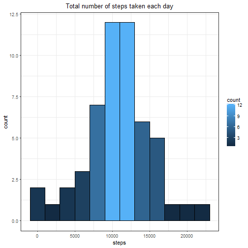
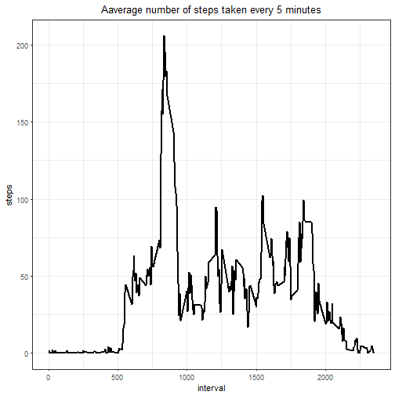
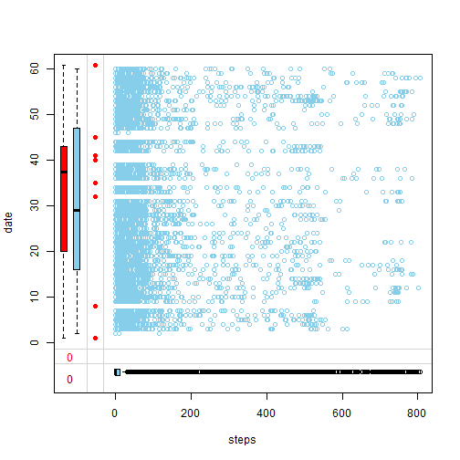
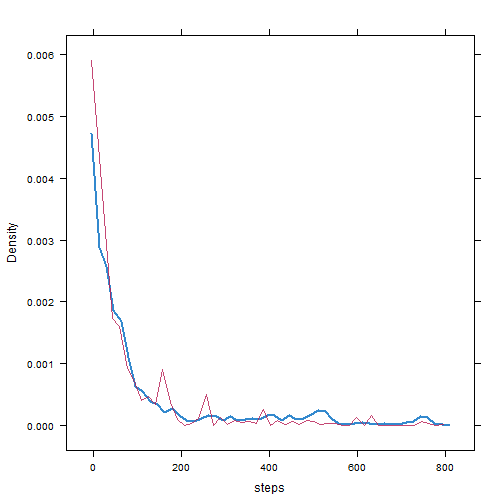
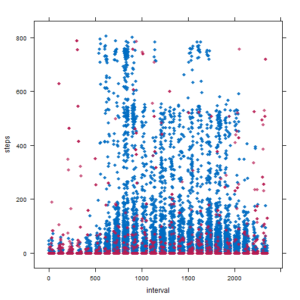
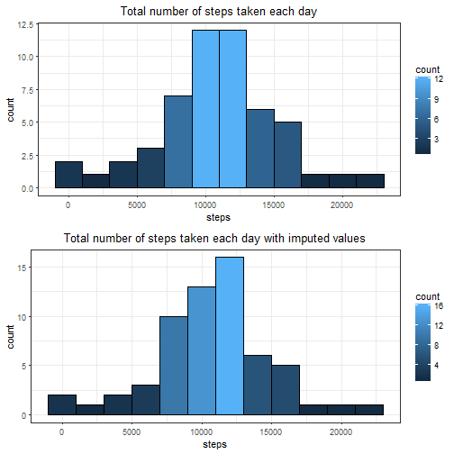
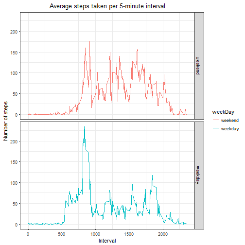

## Introduction

It is now possible to collect a large amount of data about personal movement using activity monitoring devices such as a Fitbit, Nike Fuelband, or Jawbone Up. These type of devices are part of the "quantified self" movement - a group of enthusiasts who take measurements about themselves regularly to improve their health, to find patterns in their behavior, or because they are tech geeks. But these data remain under-utilized both because the raw data are hard to obtain and there is a lack of statistical methods and software for processing and interpreting the data.

This assignment makes use of data from a personal activity monitoring device. This device collects data at 5 minute intervals through out the day. The data consists of two months of data from an anonymous individual collected during the months of October and November, 2012 and include the number of steps taken in 5 minute intervals each day.

The data for this assignment can be downloaded from the course web site:

Dataset:[Activity monitoring data [52K]](https://d396qusza40orc.cloudfront.net/repdata%2Fdata%2Factivity.zip)
The variables included in this dataset are:

* **steps:** Number of steps taking in a 5-minute interval (missing values are coded as NA)
* **date:** The date on which the measurement was taken in YYYY-MM-DD format
* **interval:** Identifier for the 5-minute interval in which measurement was taken
The dataset is stored in a comma-separated-value (CSV) file and there are a total of 17,568 observations in this dataset.


#### Review criteria

#### Repo

1. Valid GitHub URL
2. At least one commit beyond the original fork
3. Valid SHA-1
4. SHA-1 corresponds to a specific commit

#### Commit containing full submission
1. Code for reading in the dataset and/or processing the data
2. Histogram of the total number of steps taken each day
3. Mean and median number of steps taken each day
4. Time series plot of the average number of steps taken
5. The 5-minute interval that, on average, contains the maximum number of steps
6. Code to describe and show a strategy for imputing missing data
7. Histogram of the total number of steps taken each day after missing values are imputed
8. Panel plot comparing the average number of steps taken per 5-minute interval across weekdays and weekends
9. All of the R code needed to reproduce the results (numbers, plots, etc.) in the report


## R code
### Code for reading in the dataset and/or processing the data

```r
library(ggplot2)
library(dplyr)
library(mice)
library(VIM)
library(lattice)
library(gridExtra)
#don't forget to Change your repo path 

activity<- read.csv("Week2/activity.csv")

# look at the data
str(activity)
```

```
## 'data.frame':	17568 obs. of  3 variables:
##  $ steps   : int  NA NA NA NA NA NA NA NA NA NA ...
##  $ date    : Factor w/ 61 levels "2012-10-01","2012-10-02",..: 1 1 1 1 1 1 1 1 1 1 ...
##  $ interval: int  0 5 10 15 20 25 30 35 40 45 ...
```

```r
summary(activity)
```

```
##      steps                date          interval     
##  Min.   :  0.00   2012-10-01:  288   Min.   :   0.0  
##  1st Qu.:  0.00   2012-10-02:  288   1st Qu.: 588.8  
##  Median :  0.00   2012-10-03:  288   Median :1177.5  
##  Mean   : 37.38   2012-10-04:  288   Mean   :1177.5  
##  3rd Qu.: 12.00   2012-10-05:  288   3rd Qu.:1766.2  
##  Max.   :806.00   2012-10-06:  288   Max.   :2355.0  
##  NA's   :2304     (Other)   :15840
```

```r
attach(activity)
```

```
## The following objects are masked from activity (pos = 6):
## 
##     date, interval, steps
```

### Histogram of the total number of steps taken each day

```r
totStep<-aggregate(steps ~ date, activity, sum,na.action = na.omit)  
  #aggregate(date ~ steps, activity, sum,na.action = na.omit)
g1<-ggplot(data=totStep, aes(steps)) + 
    geom_histogram(col="black",binwidth = 2000, aes(fill=..count..))+
    labs(title="Total number of steps taken each day")+
    theme_bw() +
    theme(plot.title = element_text(hjust = 0.5))

grid.arrange(g1, nrow=1, ncol=1)
```



### Mean and median number of steps taken each day

```r
#mean
mean(totStep$steps)
```

```
## [1] 10766.19
```

```r
#median
median(totStep$steps)
```

```
## [1] 10765
```

### Time series plot of the average number of steps taken

```r
  avgStepsInterval <- aggregate(steps ~ interval,activity, mean,na.action = na.omit)
  ggplot(data=avgStepsInterval, aes(x=interval, y=steps)) + 
  geom_line(col="black", size=1)+
  labs(title="Aaverage number of steps taken every 5 minutes")+
  theme_bw() +
  theme(plot.title = element_text(hjust = 0.5))
```



### The 5-minute interval that, on average, contains the maximum number of steps


```r
print( paste("The 5-minute interval that, on average, contains the maximum number of steps is:",which.max(avgStepsInterval$steps),"with",round(avgStepsInterval[which.max(avgStepsInterval$steps),"steps"]),"steps." ))
```

```
## [1] "The 5-minute interval that, on average, contains the maximum number of steps is: 104 with 206 steps."
```
### Code to describe and show a strategy for imputing missing data
1. Remember after runing the summary function we saw that the only variable with missing values is "steps"
2. Now we need to investigate the missing values occur is there a specific interval? a specific date? a specific group of interval?
   

```r
head(arrange(aggregate(steps ~ date, data=activity, function(x) {sum(is.na(x))}, na.action = na.pass),desc(steps)),10)
```

```
##          date steps
## 1  2012-10-01   288
## 2  2012-10-08   288
## 3  2012-11-01   288
## 4  2012-11-04   288
## 5  2012-11-09   288
## 6  2012-11-10   288
## 7  2012-11-14   288
## 8  2012-11-30   288
## 9  2012-10-02     0
## 10 2012-10-03     0
```

```r
head(arrange(aggregate(steps ~ interval, data=activity, function(x) {sum(is.na(x))}, na.action = na.pass),desc(interval)),10)
```

```
##    interval steps
## 1      2355     8
## 2      2350     8
## 3      2345     8
## 4      2340     8
## 5      2335     8
## 6      2330     8
## 7      2325     8
## 8      2320     8
## 9      2315     8
## 10     2310     8
```

3. We can see that there are eight days with 288 missing values which means they have no values at all as the maximum interval per day is 288
  There are 8 misisng values for every sinbgle interval which is obviously caused by the 8 days with no values
  In this case it was easy to fin where the missing data occured but it might be more tricky with a bigger dataset
  
  SO let's look at another way to find out where the missing data occur
  

```r
 #This first chat show that the only variable where missing values occur is "steps" and there is around 13% missing value for this variable
  aggr(activity, col=c('navyblue','red'), numbers=TRUE, sortVars=TRUE, labels=names(activity), cex.axis=.7, gap=3, ylab=c("Histogram of missing data","Pattern"))
```


```
## 
##  Variables sorted by number of missings: 
##  Variable     Count
##     steps 0.1311475
##      date 0.0000000
##  interval 0.0000000
```
This plot help us to understand which variable contains missing values and the total % of missing/ non-missing value in our dataset


```r
marginplot(activity[c("steps","date")])
```



Although we can only plot 2 variables with this plot we can find interesting insights.
The red box plot on the left shows the distribution of the variable date with the variable steps missing while the blue box plot shows the distribution of the remaining datapoints. 
We can also spot the 8 red dots which are the 8 dates with missing steps.

4. In order to imput the missing data I use the mice() function that will care of the imputing process

```r
tempData <- mice(activity,m=1,maxit=20,meth='pmm',seed=500)
```

```
## 
##  iter imp variable
##   1   1  steps
##   2   1  steps
##   3   1  steps
##   4   1  steps
##   5   1  steps
##   6   1  steps
##   7   1  steps
##   8   1  steps
##   9   1  steps
##   10   1  steps
##   11   1  steps
##   12   1  steps
##   13   1  steps
##   14   1  steps
##   15   1  steps
##   16   1  steps
##   17   1  steps
##   18   1  steps
##   19   1  steps
##   20   1  steps
```

```r
densityplot(tempData)
```


The density of the imputed data is showed in magenta while the density of the observed data is showed in blue. 
Imputed data and obsevered data seem to have a similar distribution.


```r
xyplot(tempData,steps ~ interval ,pch=18,cex=1)
```


This scatter plot shows the relation between the variables steps and interval and  we would like to see the shape
of the imputed (magenta) and observed data (blue) to be similar.
The matching shape tells us that the imputed values may be plausible value but to be honest I am a bit concern with the
left hand side outliers as well as the right hand side.
Also I have the feeling that in this case mice is a bit randoom and it would probably better for example to get the average for each day ( Mon, Thu, Wed...) and each interval and then affect those averages for each related muissing value. 
I'll try to update this part later when I'll get a better understanding of the mice package.


```r
completedData <- complete(tempData)
summary(completedData)
```

```
##      steps                date          interval     
##  Min.   :  0.00   2012-10-01:  288   Min.   :   0.0  
##  1st Qu.:  0.00   2012-10-02:  288   1st Qu.: 588.8  
##  Median :  0.00   2012-10-03:  288   Median :1177.5  
##  Mean   : 37.15   2012-10-04:  288   Mean   :1177.5  
##  3rd Qu.: 12.00   2012-10-05:  288   3rd Qu.:1766.2  
##  Max.   :806.00   2012-10-06:  288   Max.   :2355.0  
##                   (Other)   :15840
```

We can see now that there is no missing values remaining in our dataset.
### Histogram of the total number of steps taken each day after missing values are imputed

```r
totStepFull<-aggregate(steps ~ date, completedData, sum)  
  #aggregate(date ~ steps, activity, sum,na.action = na.omit)
g2<-ggplot(data=totStepFull, aes(steps)) + 
geom_histogram(col="black",binwidth = 2000, aes(fill=..count..))+
  labs(title="Total number of steps taken each day with imputed values")+
  theme_bw() +
  theme(plot.title = element_text(hjust = 0.5))
grid.arrange(g1,g2, nrow=2, ncol=1)
```


There isn't a big difference between the plot with missing values and the one with the imputed values.
The only thing I can say is that the distribution look a litle bit skewed to the left.
Remember the chart with the missing values has almost the same mean =10766.19 and median = 10765.
As the data are left skewed the median will be higher than the mean.

```r
#mean
mean(totStepFull$steps)
```

```
## [1] 10699.23
```


```r
#median
median(totStepFull$steps)
```

```
## [1] 10765
```

So the new dataframe with the imputed value still has the same median but has a lower mean so as stated before the new dataframe is a litle bit skewed to the left.

### Panel plot comparing the average number of steps taken per 5-minute interval across weekdays and weekends

```r
#We need first to create a variable that will help us to distinguish week-day and week-end
activity$date <- as.Date(activity$date)
#create a vector of weekdays
MonToFri <- c('Monday', 'Tuesday', 'Wednesday', 'Thursday', 'Friday')
#Use `%in%` and `weekdays` to create a logical vector
#convert to `factor` and specify the `levels/labels`
activity$weekDay <- factor((weekdays(activity$date) %in% MonToFri), 
                    levels=c(FALSE, TRUE), labels=c('weekend', 'weekday')) 


# Create the aggregated data frame by intervals and day_type
avgStepInterval <- aggregate(steps ~ interval+weekDay, activity, mean)

ggplot(avgStepInterval, aes(interval, steps)) +
    geom_line(stat = "identity", aes(colour = weekDay)) +
    theme_bw() +
    labs(x="Interval", y="Number of steps",title="Average steps taken per 5-minute interval") +
    theme(plot.title = element_text(hjust = 0.5))+
    facet_grid(weekDay ~ .) 
```


